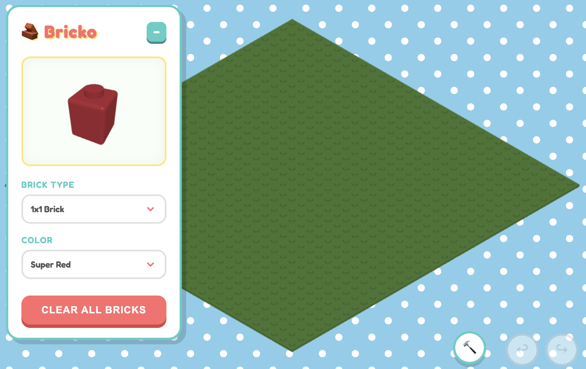

# 🧱 Bricko

A simple, kid-friendly 3D brick builder in the browser.

## 🎮 Demo

Play it here: **[https://appunni.github.io/bricko/](https://appunni.github.io/bricko/)**

## ✨ Features

- **Build**: Place bricks of various sizes and colors.
- **Destroy**: Use the Hammer tool to remove bricks.
- **Undo/Redo**: Easily fix mistakes.

## 🛠️ Tech Stack

- **Three.js**: For 3D rendering.
- **Vite**: For fast development and building.
- **GitHub Actions**: For automated deployment.

## 🚀 Local Development

1.  Clone the repo.
2.  Run `npm install`.
3.  Run `npm run dev`.
